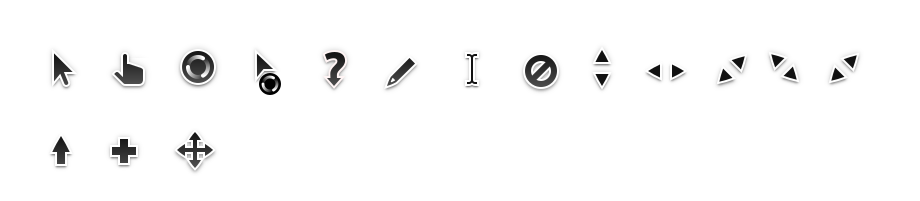

# Yaru Cursors for Windows 🖱️

A sleek Ubuntu-inspired cursor theme for Windows 10/11, ported from the original **Yaru Design** with high-DPI support and smooth animations.

 *(Cursor preview)*

---

## Features ✨
- **Ubuntu Yaru Style**: Familiar design for Linux-to-Windows users.
- **High-DPI Ready**: Crisp rendering on 4K/retina displays.
- **Smooth Animations**: Animated `busy.ani` and `wait.ani` cursors.
- **Easy Installation**: One-click setup via `.inf` file.
- **Lightweight**: Minimal performance impact.

---

## Installation 🛠️

### Automated Installation (Recommended)
1. Download the zip from Github or clone the repository
2. **Right-click** `install.inf` and select **Install**.
3. Open **Mouse Settings**:
   - Go to *Settings > Devices > Mouse > Additional mouse options*.
   - Select **Yaru Cursors** from the *Scheme* dropdown.
4. Click **Apply** and enjoy!
